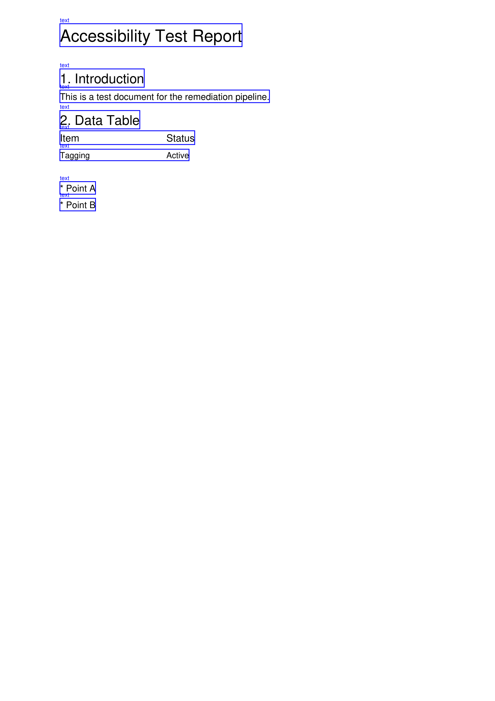
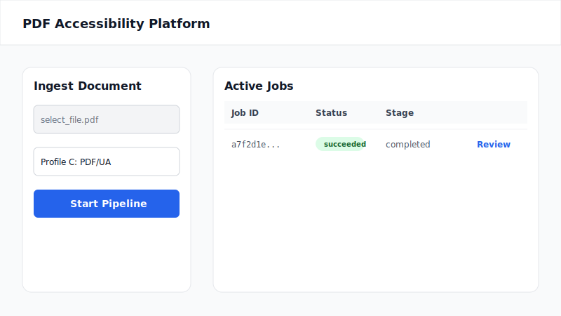
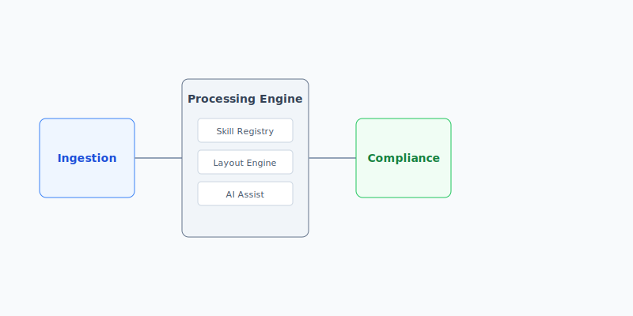
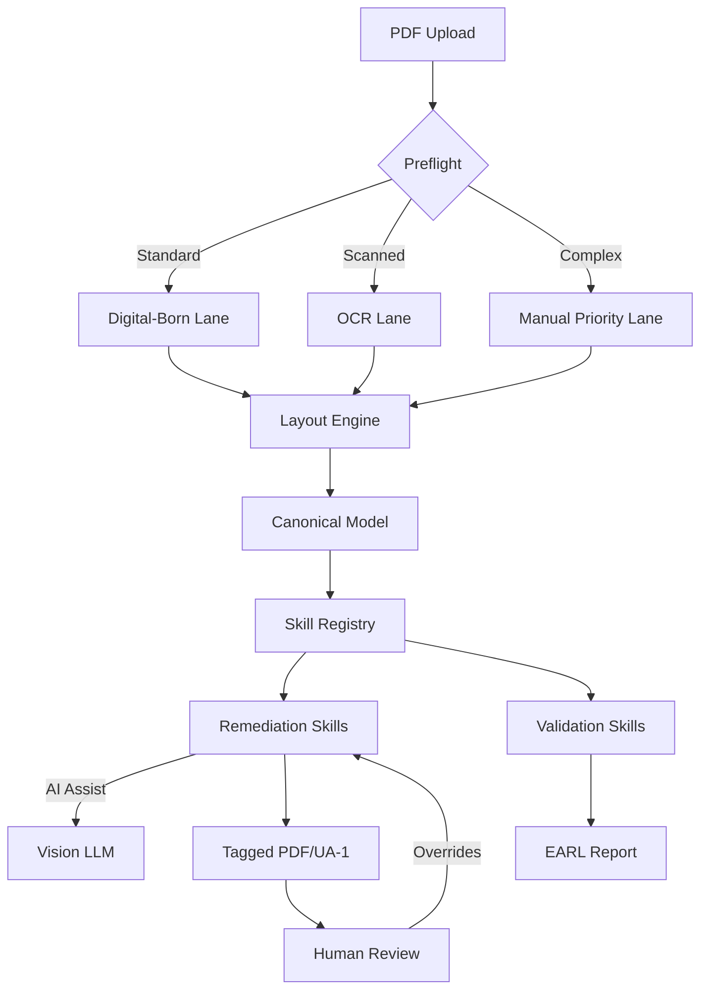

# PDF Accessibility Platform (PARP)

[](https://github.com/your-username/pdf-accessibility-platform)
[](https://opensource.org/licenses/MIT)
[](https://www.python.org/)
[](https://nextjs.org/)

An enterprise-grade, end-to-end pipeline designed to automate PDF accessibility remediation. Aligned with **Section 508**, **ADA Title II**, **WCAG 2.1 AA**, and **PDF/UA-1** standards.

---

## 🌟 Key Features

*   **Modular Skill Registry**: A pluggable engine where each remediation and validation rule is an independent "Skill."
*   **Compliance Profiles**: Automatically routes documents to specialized lanes (Section 508, ADA, or PDF/UA) based on desired standards.
*   **AI-Assisted Remediation**: Integrated vision-capable LLMs (GPT-4o/Claude 3.5) for high-accuracy alt-text generation and semantic role disambiguation.
*   **Human-in-the-Loop (HITL)**: A dedicated Next.js dashboard for side-by-side review and manual overrides of AI suggestions.
*   **Advanced Layout Engine**: Column-aware reading order reconstruction and heuristic-based detection of tables and interactive forms.
*   **Standards Validation**: Generates machine-readable **EARL 1.0** reports mapped directly to Matterhorn Protocol checkpoints.

---

## 📸 Platform Capabilities

### 1. Structural Intelligence (Actual Tool Output)
The engine automatically identifies complex structures like tables, headings, and form fields, assigning appropriate semantic roles for PDF/UA tagging.


### 2. Modern Review Dashboard
Inspect detected regions side-by-side with the original PDF. Reviewers can override AI suggestions, edit alt-text, and refine form tooltips in real-time.


### 3. Modular Architecture
Engineered for scale with a clear separation between parsing, modular skills, and the tagging engine.


---

## 🏗 Architectural Workflow



---

## 🚀 Fast Track: Docker Setup (Recommended)

The easiest way to run the full stack (API + Workers + UI + Redis + MinIO) is using Docker Compose.

### 1. Configure Environment
Create a `.env` file in the root directory:
```bash
# AI Provider Configuration
AI_PROVIDER=openai
OPENAI_API_KEY=sk-your-key-here

# Frontend Configuration
NEXT_PUBLIC_API_URL=http://localhost:8000/api/v1
```

### 2. Launch the Stack
```bash
docker-compose up --build
```

### 3. Access the Services
*   **Review Dashboard**: [http://localhost:3000](http://localhost:3000)
*   **API Documentation (Swagger)**: [http://localhost:8000/docs](http://localhost:8000/docs)
*   **S3 Storage (MinIO Console)**: [http://localhost:9001](http://localhost:9001)

---

## 💻 Local Development (Conda)

### 1. Setup Environment
```bash
conda activate revival
pip install -e .[dev]
```

### 2. Start Services
You will need three terminal windows:

*   **Terminal 1 (API)**: `python -m pdf_accessibility.main`
*   **Terminal 2 (Worker)**: `celery -A pdf_accessibility.core.celery worker --loglevel=info`
*   **Terminal 3 (UI)**: `cd ui && npm install && npm run dev`

---

## 🛠 Tech Stack

*   **Backend**: FastAPI, Celery, Redis
*   **Frontend**: Next.js 14, Tailwind CSS, Lucide React
*   **PDF Internals**: `pikepdf` (direct tree manipulation), `PyMuPDF` (layout extraction)
*   **AI**: OpenAI GPT-4o, Anthropic Claude 3.5 Sonnet
*   **OCR**: Tesseract 5.x
*   **Storage**: Local FileSystem or S3-compatible (MinIO/AWS)

---

## 🧪 Verification

### Run Automated Tests
```bash
$env:PYTHONPATH = "src;."
python -m pytest tests/
```

---

## 📄 License
This project is licensed under the MIT License.
